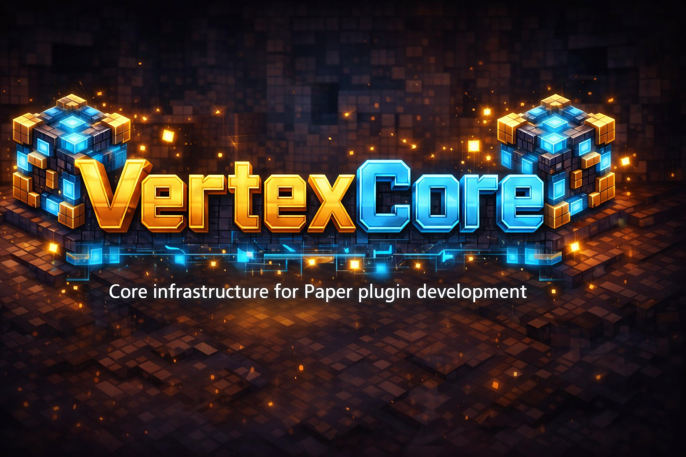

  

# VertexCore

VertexCore is a **core plugin** for Minecraft that simplifies the **creation and management of configuration files and databases** for other plugins.

It provides shared infrastructure and acts as a common foundation to avoid re-implementing the same technical logic across multiple projects.

---

## Purpose

VertexCore has a clearly defined scope:

- Simplified configuration management
- Unified database handling
- Reduction of boilerplate code in feature plugins
- Central maintenance of technical infrastructure

VertexCore contains **no gameplay or feature logic**.

---

## Features

### Configuration Management
- Centralized creation and management of YAML configuration files
- Unified loading, saving, and reload mechanisms
- Support for multiple config files per plugin
- Clear separation between default configs and dynamic files

### Databases
VertexCore abstracts access to different storage backends.

Supported database types:
- **JSON** (file-based)
- **H2** (embedded)
- **MySQL / MariaDB**

Provided functionality:
- Unified database initialization
- Centralized management of connection settings
- Reusable database utilities
- Shared database logic across multiple plugins

---

## Requirements

- **Minecraft Server:** Paper (recommended)
- **Java:** 17 or higher
- **Platform:** Paper API

---

## Installation

1. Place `VertexCore.jar` into the `plugins/` directory
2. Start the server
3. Add plugins that use `VertexCore`

---

## Development & Usage

Detailed usage instructions, API examples, and best practices for plugin developers can be found in:

➡ **[DEVELOPMENT.md](DEVELOPMENT.md)**

---

## Development Philosophy

- Lightweight core plugin with a clearly defined responsibility
- Extensions only when they benefit multiple plugins
- Strict separation of infrastructure and feature logic
- Focus on maintainability and clarity

---

## Compatibility

- Developed for modern Paper versions
- No support for Spigot or CraftBukkit
- Changes to the core may affect dependent plugins

---

## License / Usage

VertexCore is intended for internal use.  
External usage or redistribution requires prior agreement.

---

## Support

- Bug reports and suggestions via GitHub Issues
- No guarantee of API stability outside documented functionality
